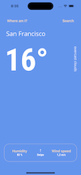
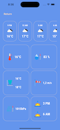
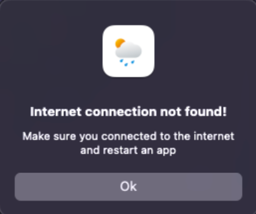

# Weather App

based on [openweathermap/api](https://openweathermap.org/api)

This is a [.NET 7 MAUI ](https://dotnet.microsoft.com/en-us/apps/maui)app which shows current weather and forecast for the next 5 days.

## [CHANGELOG](CHANGELOG.md)

## Screenshots

 

## Instalation

How to install you can find [here.](https://github.com/dotnet/maui/wiki#getting-started)
After instalation write your APIKEY from [openweathermap.org](https://openweathermap.org/api) in [ApiService.cs](https://github.com/stbestichhh/Weather-Forecast/blob/master/WeatherApp/Services/ApiService.cs)

## FAQ

### This app requires internet connection

> 

## Links

**.NET MAUI: [Website](https://dotnet.microsoft.com/en-us/apps/maui "dotnet.com/maui")** **|** **[Instalation](https://github.com/dotnet/maui/wiki#getting-started "github.com/dotnet/maui")**

**OpenWeatherMap: [Website](https://openweathermap.org)** **|** **[API](https://openweathermap.org/api "openweathermap/api")**

## Autors

- [@stbestichhh](https://github.com/stbestichhh)

## Support

If you need any support, you have my **[email](mailto:stbestich@gmail.com)**;
